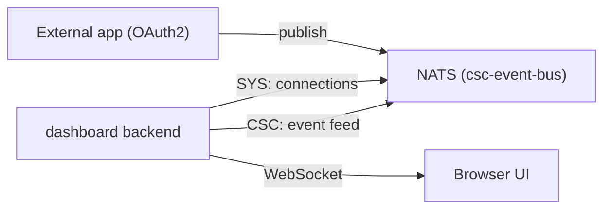

# DSX Live Dashboard

A live web dashboard for the local DSX Exchange stack. It shows:

- Connected clients live (per-connection: account, name, transport, address,
  subscriptions, message counters, uptime) with connect/disconnect activity. A
  "MQTT only" toggle filters the table to MQTT transports, and each row shows a
  transport badge (NATS, MQTT, or WS).
- A live feed of events observed on the CSC account, with a subject/payload
  filter and an events-per-second meter.
- An "AI Factory Power" section: live requests per second, power usage versus the
  DSX Flex power target, compliance, shed rate, breach alerts, and history charts
  (with legends), driven by the mock inference service (see
  [../inference-mock/README.md](../inference-mock/README.md)). A "Power target
  last set by" card names the ISV that last issued a `grid.loadtarget.set`
  command, the requested cap, the feeds it applies to, and when it arrived.

A "Connection info" button in the top bar opens a dialog with the **public**
endpoints and credentials external systems need: the OpenAI-compatible completion
API (for an EDN system) and the DSX Flex MQTT broker, OAuth2 token URL, ISV
credentials, and CloudEvents topics (for an energy system). These addresses are
served from the dashboard's configuration (`DASHBOARD_PUBLIC_*` /
`DASHBOARD_FLEX_*`, see [Configuration](#configuration)), so operators set them to
the real externally reachable endpoints once, and the dialog shows a single clean
address per surface instead of in-cluster DNS. Each value is click-to-copy, and
the layout is responsive and reflows for narrow viewports. For what to expose and
how, see the [DevOps runbook](../inference-mock/README.md#exposing-to-external-systems-devops).

It is a local evaluation tool (like `mqtt-client` and `dummy-bms`); it is not
part of the production charts.

## How it works

The dashboard runs in-cluster in the `csc-event-bus` namespace and holds two
NATS connections:

- SYS account (via the `nats-surveyor` NKey secret): subscribes to
  `$SYS.ACCOUNT.*.CONNECT` / `.DISCONNECT` and polls
  `$SYS.REQ.SERVER.PING.CONNZ` for the live connection roster.
- CSC account (via OAuth2 client credentials, client `dashboard`): subscribes to
  `>` and forwards observed subjects/payloads.

Browser updates stream over a WebSocket. See the architecture and rationale in
the plan and in [../../docs/architecture.md](../../docs/architecture.md).



## Open the dashboard

Deployed automatically by `make local-up`. Port-forward the UI (no MetalLB or
`sudo` networking tweak required):

```bash
make dashboard-ui
# then open http://localhost:8080
```

Or directly:

```bash
kubectl --context kind-dsx-exchange -n csc-event-bus port-forward svc/dsx-dashboard 8080:80
```

## Send authorized events (end-to-end demo)

The `demo-publisher` command connects as the OAuth2 client `demo-app`, obtains a
token from the local IdP, and publishes sample events over MQTT. Those events
appear immediately in the dashboard event feed, and the publisher shows up as a
live connection.

In separate terminals, port-forward the broker and IdP, then run the publisher:

```bash
# Terminal 1: MQTT broker
kubectl --context kind-dsx-exchange -n csc-event-bus port-forward svc/nats 1883:1883

# Terminal 2: local IdP (token endpoint)
kubectl --context kind-dsx-exchange -n idp port-forward svc/event-bus 5556:5556

# Terminal 3: publish sample events
make dashboard-demo
```

You can also drive the richer BMS dataset with `make dummy-bms` (requires the
host-to-broker networking tweak described in `local/README.md`).

## Connect your own application

Any MQTT client can publish using the OAuth2 path:

1. Register an OAuth2 client in
   [../idp/secret-generator/credentials.yaml.tmpl](../idp/secret-generator/credentials.yaml.tmpl)
   and a matching permissions entry in
   [../event-bus/k8s/csc/values.yaml](../event-bus/k8s/csc/values.yaml)
   (`global.eventBus.auth.permissions.oauth2.<name>`), then redeploy.
2. Obtain a token: `POST /token` (client credentials, scope `mqtt`) at the IdP.
3. Connect over MQTT with username `oauthtoken` and the token as the password.
4. Publish to a subject your client is permissioned for.

## Configuration

The backend reads environment variables (Helm values set these):

| Variable                        | Default                                       | Purpose                              |
| ------------------------------- | --------------------------------------------- | ------------------------------------ |
| `DASHBOARD_HTTP_ADDR`           | `:8080`                                       | UI/WebSocket listen address          |
| `DASHBOARD_NATS_URL`            | `nats://nats:4222`                            | NATS endpoint                        |
| `DASHBOARD_SYS_NKEY_SEED_FILE`  | `/etc/dsx-dashboard/sys/seed`                 | SYS-account NKey seed                |
| `DASHBOARD_EVENT_SUBJECT`       | `>`                                           | Subject the event feed subscribes to |
| `DASHBOARD_DROP_INBOX_EVENTS`   | `true`                                        | Drop `_INBOX.>` reply noise          |
| `DASHBOARD_OAUTH_IDP_URL`       | `http://event-bus.idp.svc.cluster.local:5556` | IdP base URL                         |
| `DASHBOARD_OAUTH_CLIENT_ID`     | `dashboard`                                   | OAuth2 client ID                     |
| `DASHBOARD_OAUTH_CLIENT_SECRET` | `dashboard-secret`                            | OAuth2 client secret                 |

The "Connection info" dialog is populated from these public-wiring variables.
Set them to the externally reachable addresses for your deployment (the defaults
match the documented local port-forwards):

| Variable                          | Default                        | Purpose                                          |
| --------------------------------- | ------------------------------ | ------------------------------------------------ |
| `DASHBOARD_PUBLIC_COMPLETION_URL` | `http://localhost:8081/v1`     | Public OpenAI-compatible base URL (EDN)          |
| `DASHBOARD_PUBLIC_COMPLETION_MODEL` | `dsx-mock-llm`               | Model id served by the completion API            |
| `DASHBOARD_PUBLIC_MQTT_URL`       | `tcp://localhost:1883`         | Public MQTT broker URL (energy/ISV)              |
| `DASHBOARD_PUBLIC_OAUTH_TOKEN_URL`| `http://localhost:5556/token`  | Public OAuth2 token endpoint                     |
| `DASHBOARD_FLEX_ISV_CLIENT_ID`    | `grid-isv`                     | OAuth2 client id an ISV uses to publish targets  |
| `DASHBOARD_FLEX_ISV_CLIENT_SECRET`| `grid-isv-secret`              | OAuth2 client secret for the ISV client          |
| `DASHBOARD_FLEX_ISV_SCOPE`        | `mqtt`                         | OAuth2 scope required for MQTT publish           |
| `DASHBOARD_FLEX_AGENT_ID`         | `maxlps`                       | DSX Flex agent id (drives feedback topic names)  |
| `DASHBOARD_FLEX_FEED_TAG`         | `ai-factory-main`              | Power feed tag the agent represents              |

These are display-only: the dashboard does not connect with them. In a shared or
internet-facing deployment, restrict access to the dashboard itself, since the
dialog surfaces the ISV client secret.

## Scope and limitations

- Covers the CSC site. CPC-1/CPC-2 can be added later with additional
  subscribers pointed at their namespaces.
- The event feed reports subject, payload, size, and time. NATS does not tag
  each message with the publishing client ID, so individual events are not
  attributed to a specific connection; the connections panel reports per-client
  message counters instead.
