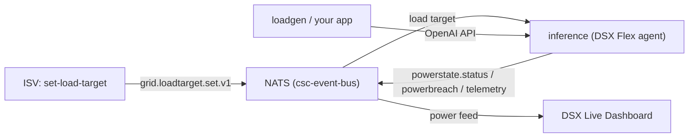

# DSX Mock AI Inference Service

A local evaluation service that mocks an AI factory inference workload and acts
as a DSX Flex agent. It demonstrates NVIDIA DSX Flex power management end to end:
grid-driven power caps flow in as events, the workload throttles its load to stay
under the cap, and the DSX Live Dashboard charts load and power in real time.

It is a local fixture (like `mqtt-client`, `dummy-bms`, and the dashboard); it is
not part of the production charts.

## What it does

- Serves an OpenAI-compatible API (`/v1/models`, `/v1/chat/completions`,
  `/v1/completions`) with streaming, token accounting, and simulated latency.
- Models power draw: each in-flight request draws a fixed amount of power
  (0.001 MW, i.e. 1 kW, by default), so effective load equals in-flight requests
  times per-request power.
- Enforces DSX Flex load targets received from the event bus using the
  `best_effort` strategy: excess demand is queued briefly and then shed with
  HTTP 429 to hold power under the cap.
- Publishes power state, breach alerts, and telemetry back to the bus.

## How it maps to DSX Flex

The service implements the DSX Flex contract in
[`schemas/asyncapi/dsx-flex/dsx-flex.yaml`](../../schemas/asyncapi/dsx-flex/dsx-flex.yaml).

| DSX Flex role | Component | Subject |
| --- | --- | --- |
| ISV (sets the cap) | `set-load-target` command | `grid.v1.isv.<id>.loadtarget.set` |
| DSX Flex Agent (enforces) | `inference` service | subscribes to load targets |
| Power state feedback | `inference` service | `grid.v1.dsx-flex-agent.<id>.powerstate.status` |
| Breach alerts | `inference` service | `grid.v1.dsx-flex-agent.<id>.powerbreach` |
| Dashboard telemetry | `inference` service | `dsx.inference.v1.telemetry` |

Messages use the CloudEvents 1.0.2 envelope from the spec. The `data` field is
carried as plaintext JSON (the schema permits it); JWS signing is a future
toggle.



## End-to-end demo

The service deploys automatically with `make local-up` into `csc-event-bus` and
is reachable through the site gateway at `http://172.18.200.1/v1/...` (the same
gateway that serves MQTT and the IdP). Open the dashboard with `make dashboard-ui`
and watch the "AI Factory Power" section.

1. Generate load (offered demand rises, power climbs toward the default cap):

   ```bash
   make loadgen LOADGEN_ARGS="--rps 40 --max-tokens 128"
   ```

2. Set a power cap through the exchange (an ISV publishes a LoadTargetSet). The
   workload throttles and sheds to hold power under the cap:

   ```bash
   make set-load-target SET_LOAD_TARGET_ARGS="--target-mw 20"
   ```

3. Lower the cap below current load to trigger a ramp-down and a breach alert,
   then restore it:

   ```bash
   make set-load-target SET_LOAD_TARGET_ARGS="--target-mw 5"
   make set-load-target SET_LOAD_TARGET_ARGS="--clear"
   ```

The dashboard shows requests per second, power usage versus target, compliance,
shed rate, breach banners, and a live history chart throughout.

## Call the API directly

Through the gateway (no port-forward, requires the macOS host networking tweak in
[../README.md](../README.md)):

```bash
curl -s http://172.18.200.1/v1/chat/completions \
  -H 'Content-Type: application/json' \
  -d '{"model":"dsx-mock-llm","messages":[{"role":"user","content":"hello"}],"max_tokens":32}'
```

Or port-forward: `make inference-api`, then use `http://localhost:8081/v1/...`.

## Exposing to external systems (DevOps)

Two external systems connect to this stack: an **EDN system** that sends
inference load to the completion API, and an **energy system (ISV)** that sends
power targets and reads power feedback over MQTT. This section lists what to
expose and how.

### Surfaces and ports

| Surface | In-cluster service | Port | Protocol | Who connects | Expose? |
| --- | --- | --- | --- | --- | --- |
| Completion API | `dsx-inference` (`csc-event-bus`) | 80 → 8080 | HTTP (OpenAI) | EDN system | Yes, via gateway/ingress |
| DSX Flex MQTT | `nats` (`csc-event-bus`) | 1883 | MQTT | Energy system (ISV) | Yes, prefer TLS on 8883 |
| OAuth2 token | `event-bus` (`idp`) | 5556 | HTTP (`/token`) | Energy system (ISV) | Yes, via gateway/ingress |
| Dashboard UI | `dsx-dashboard` (`csc-event-bus`) | 80 → 8080 | HTTP + WebSocket (`/ws`) | Operators | Internal only |
| Event bus | `nats` (`csc-event-bus`) | 4222 | NATS | Internal services | No |

The completion API is already published through the shared gateway
(`shared-gateway` in `csc-gateway`) at path prefix `/v1` via an `HTTPRoute`, so
exposing the gateway's address exposes the API.

### What to expose to the internet

1. **Completion API** — terminate TLS at the gateway/ingress and route `/v1` to
   `dsx-inference`. Give the EDN system the resulting base URL, e.g.
   `https://<host>/v1`. The mock enforces no auth; add an auth policy at the
   gateway before exposing it publicly.
2. **MQTT broker** — expose the NATS MQTT listener. Prefer a TLS listener on
   `8883` (`tls://<host>:8883`) over plaintext `1883`. Clients authenticate with
   an OAuth2 access token as the MQTT password (username `oauthtoken`).
3. **OAuth2 token endpoint** — expose the IdP `/token` endpoint over HTTPS so the
   ISV can obtain tokens (client credentials grant).

Keep the NATS client port (`4222`), the SYS/monitoring account, and the dashboard
UI on the internal network. Do not expose them to the internet.

### Provision an ISV client

Grid ISVs authenticate as an OAuth2 client scoped to publish load targets:

1. Add the client to
   [../idp/secret-generator/credentials.yaml.tmpl](../idp/secret-generator/credentials.yaml.tmpl)
   (the local stack ships `grid-isv` / `grid-isv-secret`).
2. Grant `pub` on `grid.v1.isv.>` and `sub` on `grid.v1.dsx-flex-agent.>` in
   [../event-bus/k8s/csc/values.yaml](../event-bus/k8s/csc/values.yaml), then
   redeploy. Issue a distinct client per ISV in production.

### Point the dashboard dialog at the public addresses

After exposing the surfaces, set the dashboard's public-wiring values so the
"Connection info" dialog shows the real addresses (they are display-only; the
dashboard does not connect with them). Set Helm `connectionInfo.*` on the
dashboard chart, or the `DASHBOARD_PUBLIC_*` / `DASHBOARD_FLEX_*` environment
variables — see the dashboard
[Configuration](../dashboard/README.md#configuration). For example:

```yaml
# local/dashboard/deploy/values.yaml (override per environment)
connectionInfo:
  completionURL: "https://api.example.com/v1"
  mqttURL: "tls://mqtt.example.com:8883"
  oauthTokenURL: "https://idp.example.com/token"
```

### Local access (no public addresses)

Locally there is no internet-facing address, so the defaults map to
`kubectl port-forward` on `localhost`. Run one forward per surface:

```bash
make inference-api   # completion API  -> http://localhost:8081/v1
kubectl --context kind-dsx-exchange -n csc-event-bus port-forward svc/nats 1883:1883
kubectl --context kind-dsx-exchange -n idp port-forward svc/event-bus 5556:5556
```

### Security checklist

- Terminate TLS on every exposed surface; prefer MQTT over TLS (`8883`).
- Require OAuth2 client credentials for MQTT; scope each client to the least
  subjects it needs.
- Add an auth policy in front of the completion API before public exposure — the
  mock is open by design.
- Rotate the ISV client secret; issue one client per ISV.
- Keep NATS `4222`, the SYS account, and the dashboard UI off the public network.

## Configuration

The service reads environment variables (Helm values set these):

| Variable | Default | Purpose |
| --- | --- | --- |
| `INFERENCE_HTTP_ADDR` | `:8080` | API listen address |
| `INFERENCE_AGENT_ID` | `maxlps` | DSX Flex agent identifier |
| `INFERENCE_FEED_TAG` | `ai-factory-main` | Power feed this workload represents |
| `INFERENCE_PER_REQUEST_MW` | `0.001` | Power drawn per in-flight request (MW) |
| `INFERENCE_DEFAULT_MW` | `96` | Cap when no load target is active |
| `INFERENCE_POWER_MAX_MW` | `96` | Facility power ceiling (metadata) |
| `INFERENCE_MAX_QUEUE` | `256` | Queued requests before shedding |
| `INFERENCE_MAX_QUEUE_WAIT` | `5s` | Time a request waits for a power slot |
| `INFERENCE_TOKENS_PER_SEC` | `40` | Simulated token generation rate |
| `INFERENCE_OAUTH_CLIENT_ID` | `inference` | OAuth2 client for the event plane |

## Scope and limitations

- Covers the CSC site. CPC-1/CPC-2 could be added with additional agents.
- Power is a demonstration model (1 request = 0.001 MW = 1 kW), not a real GPU
  power draw.
- The `data` field is plaintext JSON; JWS signing and verification are not yet
  enabled.
